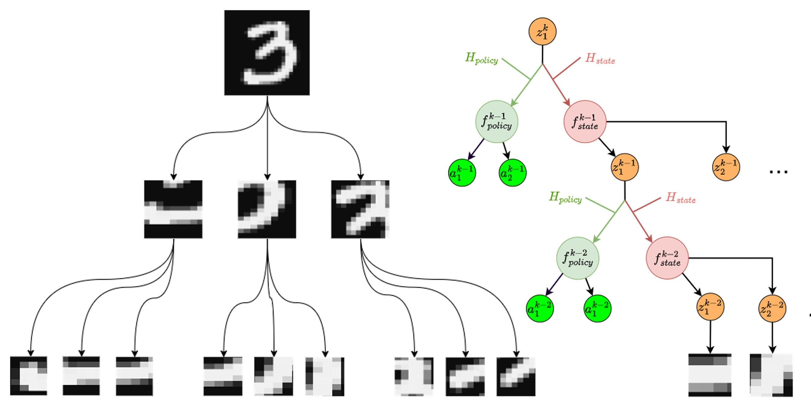
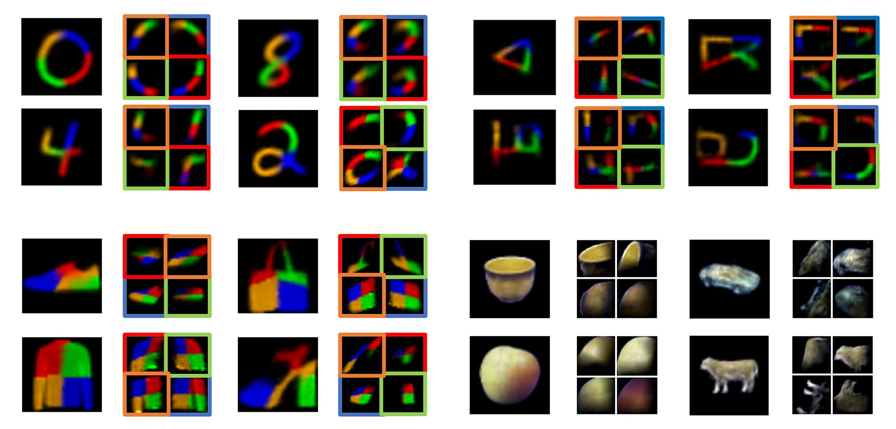

# Code Repository for Recursive Neural Programs

This is the code corresponding to the publication [Recursive neural programs: A differentiable framework for learning compositional part-whole hierarchies and image grammars](https://academic.oup.com/pnasnexus/article/2/11/pgad337/7317432)

How do you perceive a coffee cup? Unlike a classifier, that will extract features and give you a label, or an autoencoder that gives you a latent space from which to reconstruct an image, we perceive things in a much more embodied way. 

We therefore perceive something like a coffee cup in terms of how we might physically interact with it, our memories of related objects, emotions, etc. As all of these involve movement and synthesis, our perception is therefore grounded in some way in sensory-motor ways of engaging with the world. We might call these "sensory-motor programs".

A Recursive Neural Program is a novel generative architecture that models objects as recursive compositions of sensory-motor trajectories. This means that it perceives an image as a way to generate that image out of nested movement sequences. 



For an image, each sequence occurs at a different spatial scale, corresponding to parts of the object. For example, when drawing a face, a parts sequence might correspond to drawing an eye or a nose. A sub-parts sequence might be a line or a curve. The "top-level" sequence will be the composition of all the sub-sequences, resulting in a drawing of a face. 



## Run Analysis

You can run the analysis and generate figures by following the `Setup` instructions below

### MNIST t-SNE visualization

Run `scripts/analysis/mnist-tSNE.jl`. The default number of clusters is 40

### Refactoring TODO

All the analysis code is in the repo, but there is some refactoring to be done to make the code more user-friendly

- [x] MNIST t-SNE
- [ ] Omniglot model clustering
- [ ] ETH80-to-Fashion-MNIST transfer
- [ ] Generate images (Figs 2, 3)
- [ ] Comparison with vanilla VAE


## Setup

The instructions generated by DrWatson.jl should make everything work out of the box:

This code base is using the [Julia Language](https://julialang.org/) and
[DrWatson](https://juliadynamics.github.io/DrWatson.jl/stable/)
to make a reproducible scientific project named
> RNP6

It is authored by FishAres.

To (locally) reproduce this project, do the following:

1. Download this code base. Notice that raw data are typically not included in the
   git-history and may need to be downloaded independently.
2. Open a Julia console and do:
   ```
   julia> using Pkg
   julia> Pkg.add("DrWatson") # install globally, for using `quickactivate`
   julia> Pkg.activate("path/to/this/project")
   julia> Pkg.instantiate()
   ```

This will install all necessary packages for you to be able to run the scripts and
everything should work out of the box, including correctly finding local paths.

You may notice that most scripts start with the commands:
```julia
using DrWatson
@quickactivate "RNP6"
```
which auto-activate the project and enable local path handling from DrWatson.
